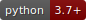

[](https://fidelity.github.io/spock/)
> Managing complex configurations any other way would be highly illogical...

[](https://opensource.org/licenses/Apache-2.0)
[]()
[]()
[]()
[]()
[]()

## About

`spock` is a framework that helps manage complex parameter configurations during research and development of Python 
applications. `spock` let's you focus on the code you need to write instead of re-implementing boilerplate code like 
creating ArgParsers, reading configuration files, implementing traceability etc.

In short, `spock` configurations are defined by simple and familiar class-based structures. This allows `spock` to 
support inheritance, read from multiple markdown formats, and allow hierarchical configuration by composition.

## Documentation

Current documentation and more information can be found [here](https://fidelity.github.io/spock/).

## Quick Install

Supports Python 3.7+

```bash
pip install spock-config
```

## Key Features

* Simple Declaration: Parameters are defined within a `@spock_config` decorated class. Supports types, required/optional, and automatic defaults.
* Easily Managed Parameter Groups: Each class automatically generates its own object within a single namespace.
* Parameter Inheritance: Classes support inheritance allowing for complex configurations derived from a common base set of parameters.
* Multiple Configuration File Types: Configurations are specified from YAML, TOML, or JSON files.
* Hierarchical Configuration: composed from multiple configuration files via simple include statements.
* Immutable: All classes are *frozen* preventing any misuse or accidental overwrites.
* Tractability and Reproducibility: Save currently running parameter configuration with a single chained command. 

#### Main Contributors

[Nicholas Cilfone](https://github.com/ncilfone), [Siddharth Narayanan](https://github.com/sidnarayanan)
___
`spock` is developed and maintained by the **Artificial Intelligence Center of Excellence at Fidelity Investments**.

